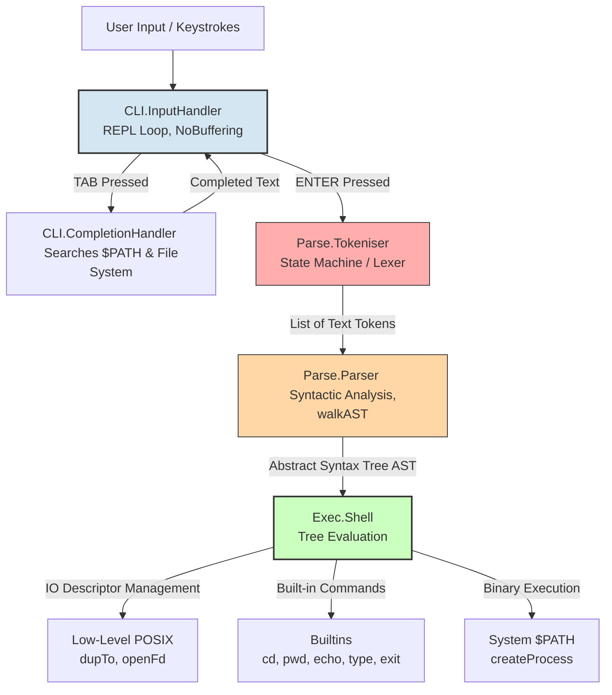

# Haskell UNIX Shell (m-koska)

My take on ["Build Your Own Shell"](https://app.codecrafters.io/courses/shell/overview) from codecrafters.

Instead of pulling in heavy-duty parsing libraries (like Megaparsec) or terminal wrappers (like Haskeline), I chose to build the core components completely from scratch. The architecture involves a state machine for tokenization, a custom parser that constructs an **Abstract Syntax Tree (AST)**, and a manual REPL loop that captures single keystrokes to support custom Tab-completion.

---

## 🏗️ System Architecture

The application adheres strictly to a classic Haskell design pattern: **Functional Core, Imperative Shell**. All text analysis, lexing, and syntactic structuring logic are 100% pure functions. Side effects and low-level system operations are isolated completely at the edges of the application.

## 🛠️ Design Choices & Technical Details

### 1. Tokeniser (`src/Parse/Tokeniser.hs`)
The implementation relies on `TokenState` data type (`NormalText`, `SingleQuoteText`, `DoubleQuotedText`, etc.). The lexer iterates through the string character-by-character, and Haskell’s compiler guarantees that every single state and pattern match combination is safely handled, making the project maintainable and allows to implement more complex syntax (like pipes) in the future.

### 2. Abstract Syntax Tree & Redirections (`src/Types.hs` & `src/Parse/Parser.hs`)
The parser does not immediately execute commands. Instead, it compiles tokens into a lightweight Abstract Syntax Tree represented by the nodes of `AST` type:
* `ExecNode Command` — Node executing either a builtin or an external binary.
* `RedirectNode RedirectionType AST FilePath WriteMethod` — Node that wraps an existing `AST` node. It effectively states: *"Execute the child tree, but first route file descriptor X to file Y using write method Z"*.

This modular structure allows recursive tree traversal via `walkAST`, making it straightforward to support complex chains or multiple redirections.

### 4. Fully Manual CLI Handling (`app/Main.hs` & `src/CLI/InputHandler.hs`)
Standard terminal applications in Haskell wait passively for a newline character. To build custom autocompletion (Tab-completion), I disabled standard terminal buffering and echo.
The REPL loop intercepts raw bytes in real time. When it detects a `\t`, it dispatches control to the `CompletionHandler`, evaluates the context of the last word typed (determining if it's a command prefix or a partial file path), updates the buffer seamlessly, or plays a system bell (`\x07`) if no matches exist.

---

## 🚀 Current Features

1. **Built-in Commands:** `pwd`, `cd` (including tilde `~` expansion), `echo`, `type`, and `exit`.
2. **System Integration:** Dynamic environment searching through `$PATH` to spawn external processes cleanly using fork/exec.
3. **String Lexing:** Full token isolation inside `'...'` and selective backslash escaping inside `"..."`.
4. **Output Redirections:** Native support for output redirecting `>`, `>>`, `1>`, `2>`, and `2>>`.